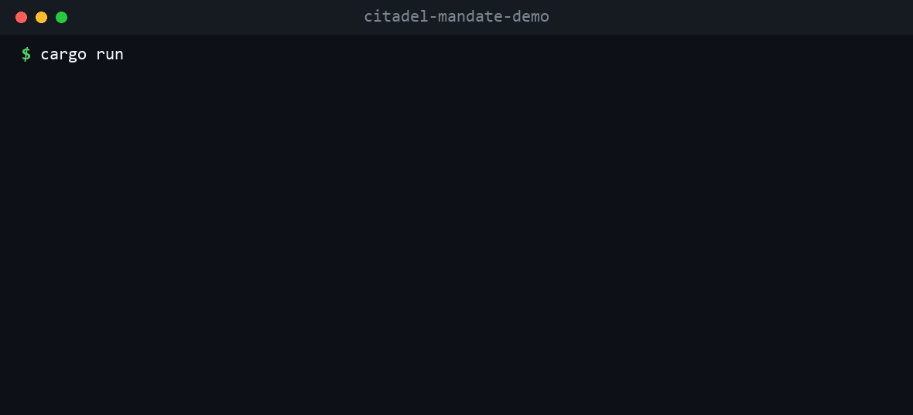

# Citadel — Intent Mandate Enforcement (open demo)

[](https://github.com/Polatkalender/citadel-mandate-demo/actions/workflows/ci.yml)
[](LICENSE)

**An AI agent acting for you can spend past its limit. Citadel is a gateway that makes sure it physically can't.**

Payment-delegation protocols for AI agents — [AP2](https://github.com/google-agentic-commerce/AP2) (Google + 60+ orgs incl. Mastercard, PayPal, Coinbase), ACP (OpenAI + Stripe), x402 — define *how* a user authorizes an agent to pay: a signed "mandate" carrying scope and limits. **They define the format; they don't enforce it at runtime.** This is the missing piece: a gateway that cryptographically verifies the user's signed mandate and **fail-closed denies** anything out of scope — *before* a payment can happen.



## Run it (one command)

**Docker** (no Rust toolchain needed):

```bash
docker build -t citadel-mandate-demo . && docker run --rm citadel-mandate-demo
```

**Or with Rust:**

```bash
cargo run
```

You'll see five scenarios run through the real enforcement pipeline:

```
SCENARIO                           RESULT  DETAIL
----------------------------------------------------------------------------
valid mandate  ($120, cap $150)    ALLOW   token ct_8f4e80fc628e · audit #1
tampered signature                 DENIED  signature verification failed · audit #2
expired mandate                    DENIED  mandate expired 2024-01-01 · audit #3
$5,000 charge (cap $150)           DENIED  over cap: 500000c > 15000c · audit #4
wrong merchant (->evil.sh)         DENIED  merchant not in allowlist: evil.sh · audit #5
----------------------------------------------------------------------------
audit chain VERIFIED · 5 entries · head a8955ae81d71…
```

Every `DENIED` is real fail-closed behaviour — the gateway actually verifies the Ed25519
signature and checks scope; it is not a scripted print. Every decision (allow *and* deny) is
written to a tamper-evident audit log. A token is minted **only** on allow.

## What it does

```
signed mandate ──► verify Ed25519 signature ──► check scope (cap · merchant · currency · expiry) ──► ALLOW + token
                          │ fail                        │ fail
                          ▼                              ▼
                        DENY                           DENY        (both audited; no token)
```

- **Verify** — the user's detached Ed25519 signature over the canonical mandate content, against a trusted `user_id → key` registry. Unknown user, bad signature, or tampered body → deny.
- **Scope** — amount cap, merchant allowlist, currency, expiry. Any violation → deny.
- **Budget** — cumulative spend per mandate is tracked; once the cap is exhausted, further charges (incl. replays) → deny.
- **Audit** — each decision chains into a hash-linked log (`sha256(prev || entry)`); altering or dropping any entry breaks `verify()`.
- **Token** — on allow, an Ed25519-signed, action-bound, expiring proof token — verifiable via `/v1/verify`.

**Protocol-neutral.** The enforcement core is one thing; the wire is pluggable.
[`src/protocol.rs`](src/protocol.rs) ships a `MandateAdapter` trait with **native,
AP2-style and ACP-style** adapters — different mandate shapes mapped onto the same
core, so the gateway enforces all of them identically (`authorize_with(&Ap2, …)`).

### Try it as an HTTP gateway

```bash
# start the gateway on :8080 (trusts one demo user)
cargo run -- serve            # or: docker run --rm -p 8080:8080 citadel-mandate-demo serve

# in another shell — mint a signed request and POST it
cargo run -- mint           | curl -s localhost:8080/v1/authorize -H 'content-type: application/json' -d @-
cargo run -- mint --over    | curl -s localhost:8080/v1/authorize -H 'content-type: application/json' -d @-
```

`mint` variants: `--valid` (default) · `--tamper` · `--expired` · `--over` · `--wrong`.

## Security

The fail-closed claim is backed by executable evidence, not assertions:

- **[`tests/adversarial.rs`](tests/adversarial.rs)** — 29 adversarial tests
  (signature forgery & tampering, key substitution, duplicate-key / type-confusion
  wires, over-cap / wrong-merchant / expired evasion, cumulative-budget overrun,
  token verification, malformed & oversized input). Every attack is **denied**;
  run `cargo test`.
- **[Security & Design report](docs/SECURITY-AND-DESIGN.md)** — threat model,
  full attack-class results, what holds vs. the documented simplifications, and how
  the demo maps to the production system.

Verdict: within the demo's scope, the enforcement is **not bypassable** and does
not panic on attacker-controlled input.

The verifier is also **fuzzed**: [`fuzz/fuzz_targets/verify.rs`](fuzz/fuzz_targets/verify.rs)
runs `verify_signed` on arbitrary bytes (`cargo +nightly fuzz run verify`), and
[`tests/properties.rs`](tests/properties.rs) asserts invariants over thousands of
randomly generated mandates (proptest, in CI).

## Performance

Single core, release build (`cargo bench`, median):

| Operation | Latency | Throughput / core |
|---|---|---|
| `verify_signed` (Ed25519 + canonical hash) | ~79 µs | ~12,600 / s |
| full `authorize` (verify → scope → budget → token → audit) | ~124 µs | ~8,000 / s |

Inline enforcement adds sub-millisecond latency to a payment decision.

## Honest scope

This is a focused, open demo of **Intent Mandate enforcement** — deliberately small so you can read it in one sitting.

- **Intent Mandates only.** No Cart or Payment mandates.
- **VC-style Ed25519** signatures over the canonical mandate content. The AP2 / ACP adapters use **realistic mandate shapes**, not certified W3C Verifiable Credential / JWS wire interop.
- The **audit log** and **token** here are simplified illustrations. The production system adds a Merkle-tree audit chain with **hybrid post-quantum** signatures (Ed25519 + ML-DSA-65) and RFC 9449 enclave-bound DPoP.
- This demo holds no money and talks to no payment processor. It is the **decision + proof** layer.

> **Security & design report:** [`docs/SECURITY-AND-DESIGN.md`](docs/SECURITY-AND-DESIGN.md) — full threat model + an adversarial test of every bypass vector (29 adversarial tests, all fail-closed).

The full **Citadel** platform — mutual-TLS identity, the post-quantum signed audit chain, a policy
engine, spend limits, kill-switch, and the multi-tenant/managed, fail-closed gateway — is a separate
product. This repo is the open wedge: the enforcement idea, runnable.

## How it maps to production

The verification *algorithm* here (`parse → canonical serialize → sha256 → ed25519 verify_strict`,
fail-closed on every error) is the same one Citadel runs on its live decision path. What's stripped
out for this demo is the platform around it, not the security core.

## Record the cast

```bash
# asciinema
asciinema rec --command 'cargo run' demo.cast
# or terminalizer / vhs — then export to docs/demo.gif
```

## CTA

**Building an agent on AP2 / ACP / x402?** Try this, then tell me what you're building and where
runtime enforcement would help — open an issue or a discussion:

- Issues: https://github.com/Polatkalender/citadel-mandate-demo/issues
- Discussions: https://github.com/Polatkalender/citadel-mandate-demo/discussions

## License

[Apache-2.0](LICENSE).
